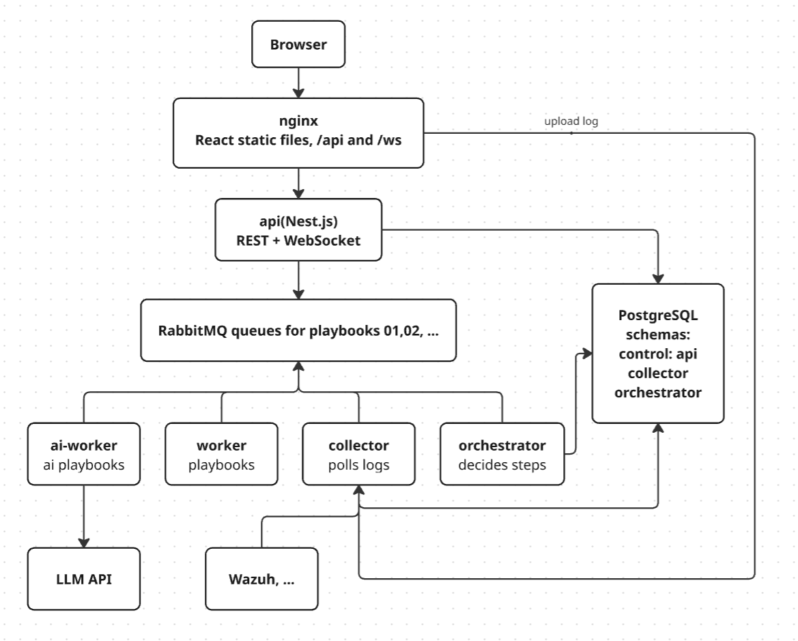

# X SOAR

Log → alert → AI analysis → report with references to log lines. Architecture: [docs/architecture.md](docs/architecture.md).

## Run

```sh
cp .env.example .env
docker compose -f docker-compose-dev.yml up -d --build
```

OpenRouter key: `OPENROUTER_API_KEY` in `.env`, model: `OPENROUTER_MODEL`. Without a key, an alert ends in `MANUAL_CHECK_REQUIRED`.

| What                             | Address                                                 |
| -------------------------------- | ------------------------------------------------------- |
| UI                               | http://localhost:5173                                   |
| api                              | http://localhost:3000/api/alerts                        |
| collector                        | http://localhost:8000/alerts (POST)                     |
| RabbitMQ UI                      | http://localhost:15672 (login and password from `.env`) |
| RabbitScout (modern RabbitMQ UI) | http://localhost:3030                                   |
| Postgres                         | localhost:5433                                          |

## Commands

```sh
# development mode: restart on code changes
docker compose -f docker-compose-dev.yml up --build --watch

# stop
docker compose -f docker-compose-dev.yml down

# stop and delete data (Postgres, RabbitMQ)
docker compose -f docker-compose-dev.yml down -v

# apply a new migration
docker compose -f docker-compose-dev.yml run --rm orchestrator-migrate
```

## Example

```sh
python -c "import json; print(json.dumps({'text': open('samples/auth-server_ssh-bruteforce.log').read(), 'labels': {'env': 'dev'}}))" \
  | curl -X POST localhost:8000/alerts -H 'content-type: application/json' --data @-
```

More logs are in `samples/`. For `multi-host_contractor-exfiltration.log`, the expected answer is in the `.expected.md` file next to it.

## Contracts

After changing `contracts/` (only Docker is needed):

```sh
docker run --rm -v "$PWD:/repo" -w /repo python:3.12-slim sh scripts/gen-py.sh
docker run --rm -v "$PWD:/repo" -w /repo node:22-alpine sh scripts/gen-ts.sh
```

Code in `packages/contracts-py` and `packages/contracts-ts` is generated; do not edit it by hand.

## Structure

Everything that runs as a container lives in `services/`, shared libraries in `packages/`. Items marked `(planned)` do not exist yet. Details: [ADR-002](docs/adr/ADR-002-repository-structure.md).

```
XSOAR/
├── CLAUDE.md                     # where to start: docs to read, key decisions
├── README.md
├── docker-compose-dev.yml        # dev environment: postgres, rabbitmq, all services
├── .env.example
├── pyproject.toml                # uv workspace root
├── uv.lock                       # one lock for all Python services
│
├── docs/
│   ├── architecture.md           # how it works + reference
│   ├── adr/                      # architecture decisions, ADR-001…ADR-005
│   ├── tasks/                    # task descriptions
│   └── LearningMaterials/
│
├── contracts/                    # JSON Schema, single source of truth for messages
│   ├── envelope.schema.json
│   ├── messages/                 # alert.created, task.playbook, task.result
│   └── playbooks/                # input/output of each playbook: p01_ai_validation.*.schema.json
│
├── services/
│   ├── frontend/                 # React + Vite (refine, shadcn)
│   ├── api/                      # NestJS, reads alerts from the orchestrator.api_alerts view
│   │   ├── prisma/schema.prisma
│   │   └── src/alerts/
│   ├── collector/                # FastAPI: accepts logs, writes collector.alerts, sends alert.created
│   │   ├── migrations/           # schema collector
│   │   └── src/xsoar_collector/
│   │       ├── app.py
│   │       └── sources/          # (planned) wazuh.py, files.py
│   ├── orchestrator/             # alert lifecycle and routing between playbooks
│   │   ├── migrations/           # schema orchestrator
│   │   └── src/xsoar_orchestrator/
│   │       ├── routing.py        # next_step: which playbook or final status comes next
│   │       ├── runs.py           # runs and tasks, passing data between playbooks
│   │       ├── transitions.py    # alert status transitions
│   │       ├── sweeper.py        # overdue tasks → MANUAL_CHECK_REQUIRED
│   │       ├── handlers/         # alerts.py, results.py
│   │       └── grouping.py       # (planned) grouping alerts into incidents
│   ├── worker-ai/                # LLM playbooks
│   │   └── src/xsoar_worker_ai/
│   │       ├── llm.py
│   │       └── playbooks/p01_ai_validation/   # playbook.py, grounding.py, prompt.txt
│   ├── worker/                   # (planned) lightweight playbooks, e.g. p02_change_approval; only a Dockerfile so far
│
├── packages/
│   ├── xsoar-common/             # Python infrastructure: db, mq, outbox, inbox, logging, worker runtime + @playbook
│   ├── contracts-py/             # generated from contracts/ (pydantic), do not edit
│   └── contracts-ts/             # generated from contracts/ (TS types), do not edit
│
├── infra/postgres/init/          # roles, schemas and grants on first start
├── scripts/                      # gen-py.sh, gen-ts.sh: code generation from contracts/
├── samples/                      # test logs; *.expected.md is the expected answer
```

Not done yet (planned): tests (`services/*/tests/`), `Makefile` (`make gen`, `make lint`, `make test`), CI (`.github/workflows/ci.yml`), pre-commit.

## Architecture



How it works, message flow, retries, statuses and storage: [docs/architecture.md](docs/architecture.md). 
